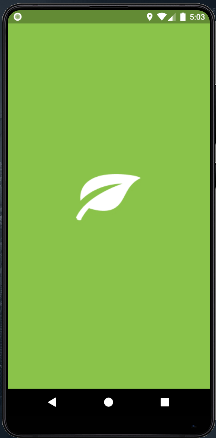
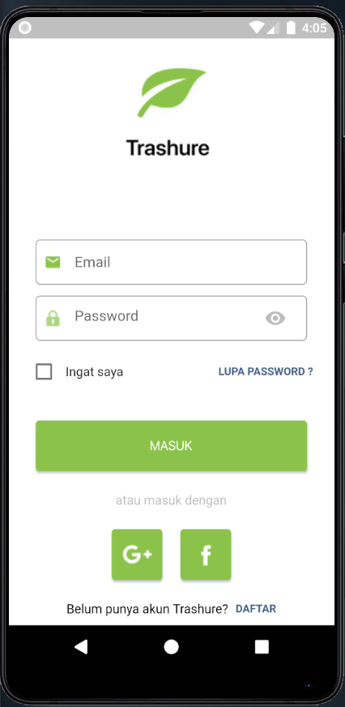
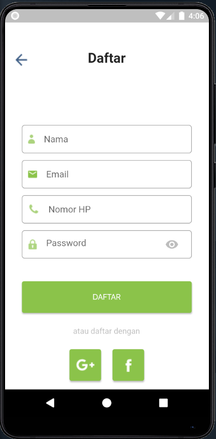

# Trashure_Flutter

# Splash Screen

# Login Page

# Signup Page

## Getting Started

Make sure you have flutter install on your machine and connected device or emulator to run this project.
1. Clone this repository
`git clone https://github.com/ramaditoferdian/Trashure-with-Flutter`

2. Install dependencies
`flutter packages get`

3. Run this project
`flutter run`

Note: If there was any error to run this project try to run this
`flutter upgrade`
`flutter clean`

For help getting started with Flutter, view our
[online documentation](https://flutter.dev/docs), which offers tutorials,
samples, guidance on mobile development, and a full API reference.
